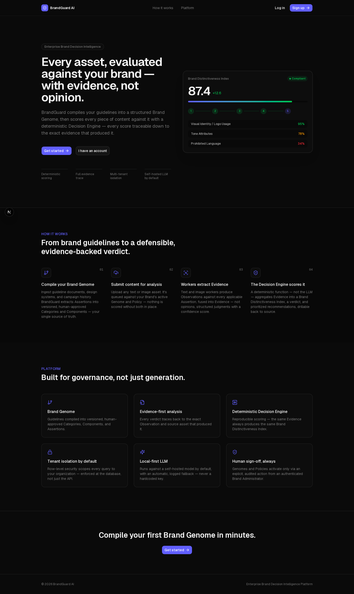
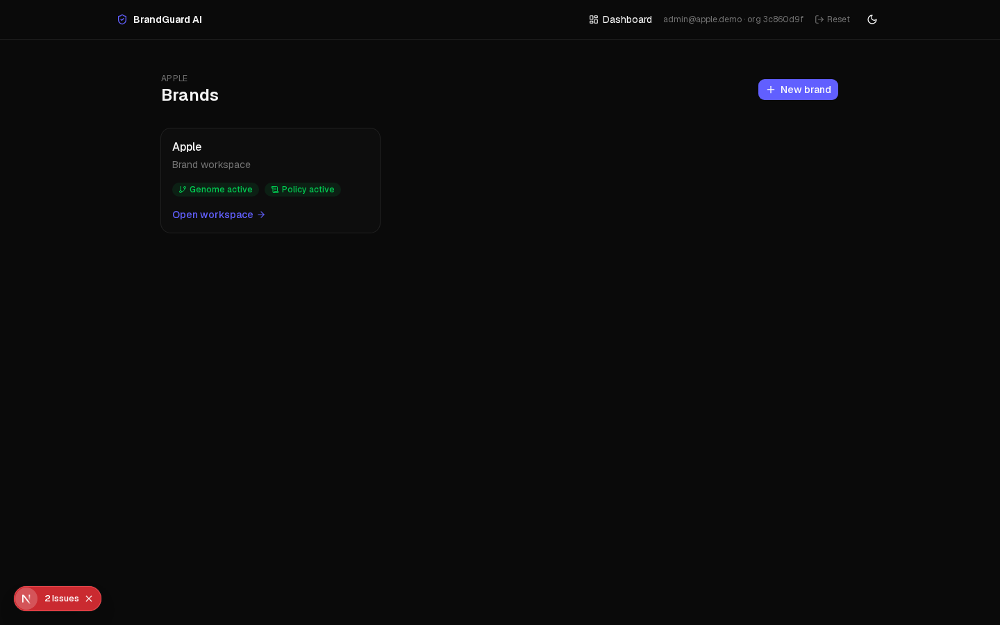
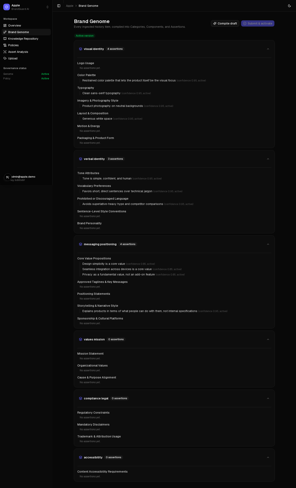
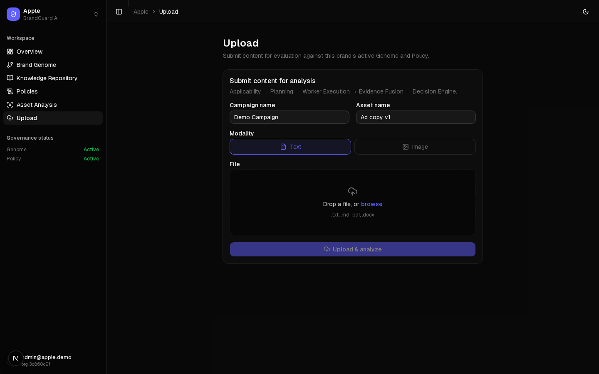

# Brandium

**Enterprise Brand Decision Intelligence Platform (BrandGuard AI)**

Brandium is a multi-tenant SaaS platform that evaluates AI-generated and human-generated marketing content (text, images, video) against an organization's own codified brand identity, producing an explainable, evidence-traceable verdict on whether that content authentically represents the brand.

It doesn't generate content and doesn't replace human creative judgment — it sits between content creation (ChatGPT, Midjourney, Firefly, internal creative teams, etc.) and publication, acting as a governance and validation layer.

Any organization can onboard by supplying its own brand assets (guidelines, logos, design systems, historical campaigns), which are compiled into a private, versioned **Brand Genome**. See [docs/01-PRD/PRD.md](docs/01-PRD/PRD.md) for the full product requirements document.

## Screenshots

| | |
|---|---|
|  |  |
|  | 
|  |

More in [docs/screenshots/](docs/screenshots/).

## Architecture

Brandium is a modular monolith backend with a Celery-based execution runtime and a Next.js frontend.

- **`backend/`** — FastAPI application (Python 3.11, SQLAlchemy async, Postgres with row-level security for tenant isolation). Organized into bounded contexts under `backend/src/`:
  - `identity_access` — auth, organizations, users, RBAC/RLS
  - `brand_governance` — Brand History ingestion, Genome compilation, Policies
  - `campaign_asset` — Campaigns and Assets (content submitted for analysis)
  - `analysis_decision` — Applicability, Planning, the Decision Engine, and orchestration of the analysis pipeline
  - `reporting` — Recommendations, explainability, and report generation
  - `platform_governance`, `shared_kernel` — cross-cutting concerns (incl. the LLM client layer)
- **`workers/`** — Celery app and tasks implementing the asynchronous analysis execution runtime (Applicability → Planning → parallel Work Unit execution → Evidence Fusion → Completeness Verification → Decision Engine → Recommendations → Report), with real-time progress tracked in Redis.
- **`frontend/`** — Next.js 15 / React 18 app (TypeScript, Tailwind, TanStack Query) — org/brand management, Brand Genome explorer, upload workspace, and live analysis progress + report views.
- **AI runtime** — [Ollama](https://ollama.com) (self-hosted, `qwen3` for LLM + `bge-m3` for embeddings) with optional [Groq](https://groq.com) as an automatic fallback.
- **Infra** — Postgres, Redis, Qdrant (vector search), MinIO (S3-compatible object storage), Prometheus + Grafana (metrics).

## Prerequisites

- Docker and Docker Compose
- (For local, non-Docker development) Python 3.11+ with [Poetry](https://python-poetry.org/), and Node.js 20+

## Getting started

```bash
cp .env.example .env
./scripts/dev_up.sh
```

This brings up Postgres, Redis, MinIO, Qdrant, and Ollama, applies database migrations, then starts the backend, worker, and frontend. Once it's up:

- Frontend: http://localhost:3000
- API docs: http://localhost:8000/docs
- MinIO console: http://localhost:9001
- Qdrant dashboard: http://localhost:6333/dashboard

First run downloads the Ollama models (several GB) — expect this to take a while.

To seed demonstration data (Apple and Red Bull brand histories run through the real ingestion pipeline):

```bash
docker compose run --rm backend python scripts/seed_data.py
```

### Full service list

`docker compose up -d` starts everything, including `prometheus` and `grafana` for observability. See [docker-compose.yml](docker-compose.yml) for the complete set of services and their ports.

## Development

**Backend**

```bash
cd backend
poetry install
poetry run pytest
poetry run ruff check .
poetry run mypy .
```

**Frontend**

```bash
cd frontend
npm install
npm run dev
npm run lint
npm run typecheck
npm test   # Playwright
```

## Documentation

- [docs/01-PRD/PRD.md](docs/01-PRD/PRD.md) — Product Requirements Document (canonical source of truth for product scope, workflows, and architecture)
- [docs/01-PRD/02-Architecture/](docs/01-PRD/02-Architecture/) — architecture deep-dives
- [docs/01-PRD/03-Diagrams/](docs/01-PRD/03-Diagrams/) — diagrams


